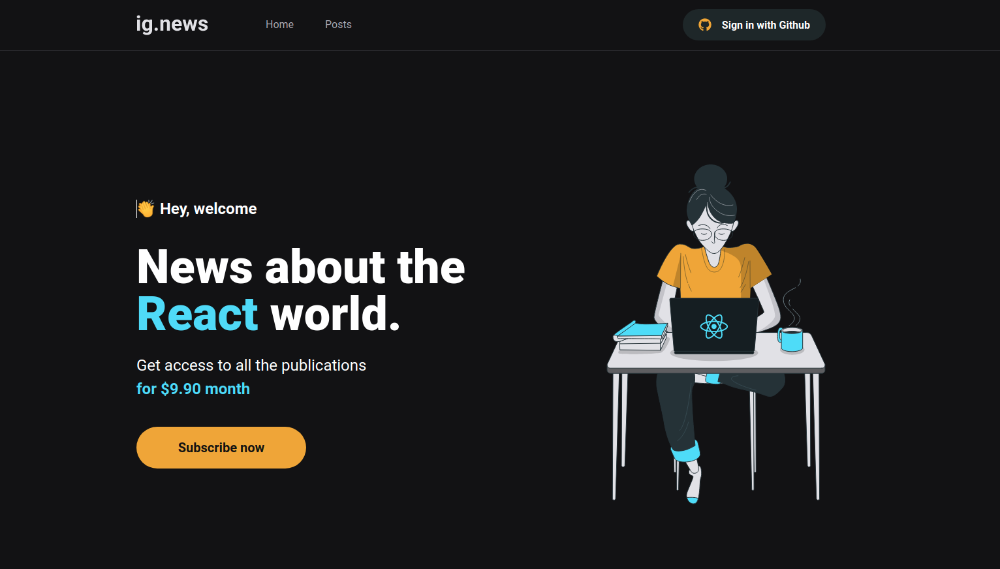
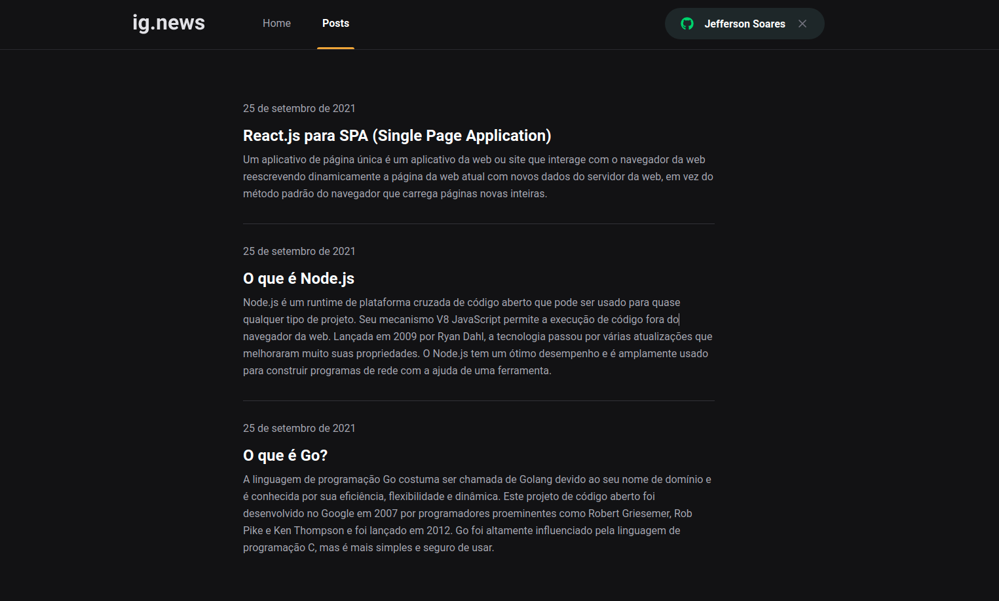
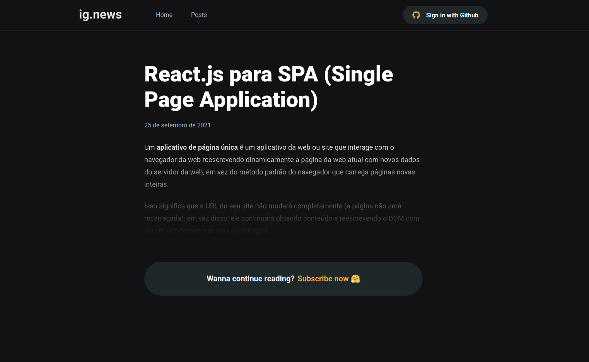
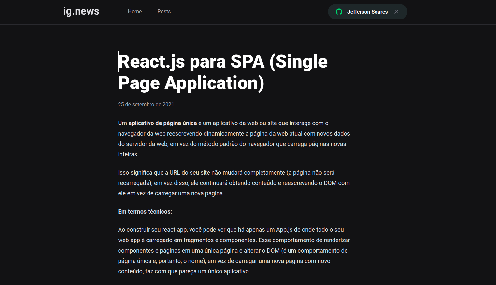

<h1 align="center">
  <a href='https://ignews-nextjs.vercel.app/' target='_blank'>IGNEWS</a>
</h1>

<p align="center">
  
  
</p>

<p align="center">
  
</p>

# 💻 About this project

Ignews is a blog that for you to be able to read the posts you need to have a monthly subscription, you pay to consume the blog's content. It was a project developed in the ignite bootcamp of the _Rocketseat_ programming school. access the project demo [clicking here](https://ignews-nextjs.vercel.app/).

# :hammer: Technologies
This project was developed with the following Tools:
- **[TypeScript](https://www.typescriptlang.org/)**
- **[Next.js](https://nextjs.org/)**
- **[FaunaDB](https://fauna.com/)**
- **[Stripe](https://stripe.com/en-br)**
- **[Prismic CMS](https://prismic.io/)**
- **[Axios](https://github.com/axios/axios)**

# 🚀 Run this project
```bash
# Clone this repository
$ git clone https://github.com/jefferson1104/ignews-nextjs

# Configure your Github Oauth for NextAuth.

# Configure FaunaDB, Stripe and Prismic services in .env
# Follow the example of the .env.example file
# After the adjustments, rename it to .env.local

# Run this application
$ yarn dev
```

# 🎨 Screenshots




